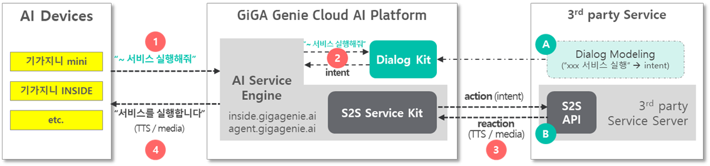
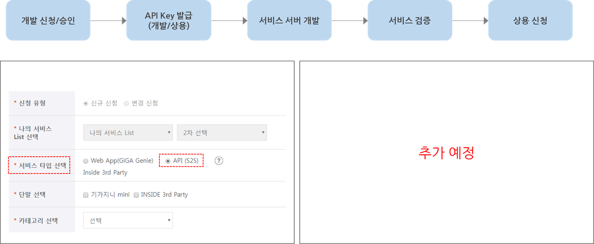
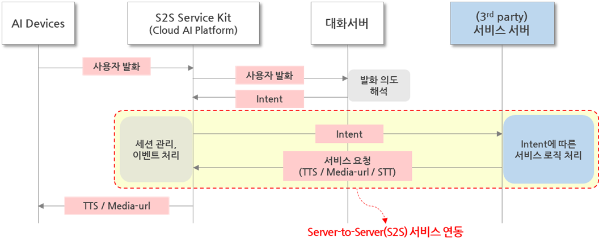
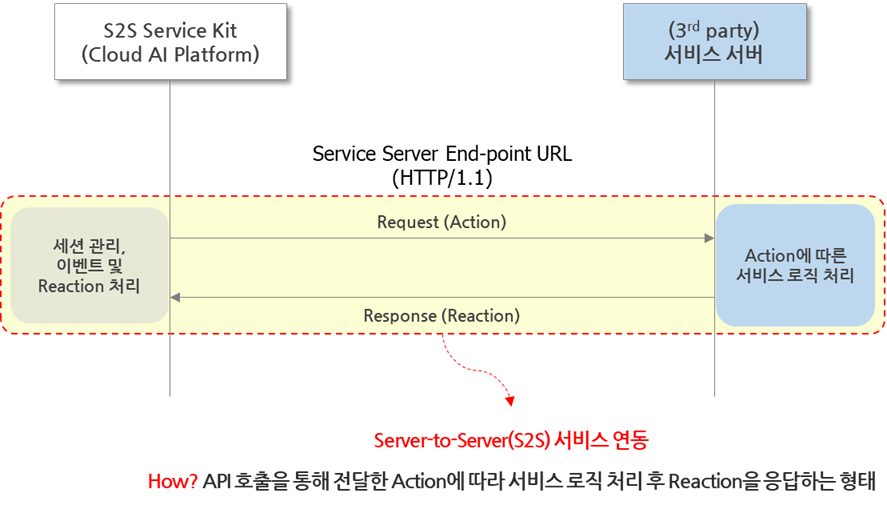

# **S2S Service Kit Specification**

S2S Service Kit(이하, S2S Kit)은 KT GiGA Genie Cloud AI Platform을 통해 서비스 및 콘텐츠를 제공하려는 3rd party 개발사를 위한 서비스 개발환경으로, 3rd party 서비스 서버에서 API를 구현하여 GiGA Genie Cloud AI Platform과의 서버간(Server-to-Server; S2S) 요청/응답을 통해 서비스와 콘텐츠를 제공한다.

본 문서는 S2S Kit의 인터페이스와 3rd party 서비스 서버에서 구현하여야 할 API 규격에 대해서 설명한다.


## **목차**

[TOC]


## **개정 이력**

 

| 버전 | 변경일자 | 변경내역 | 작성자 |
| ---- | -------- | -------- | ------ |
| v1.0.0 | 2020-03-05 | 용어 및 규격 수정<br />tts, stt 언어 설정 추가 | 이지은 |
| v1.0.1 | 2020-03-20 | 용어 수정 및 이미지 변경 | 이지은 |
| v1.0.2 | 2020-04-02 | stt 모드에 general 음성 인식 추가<br />stt 도메인 설정 추가<br />tts, stt 언어 설정 값 Number -> String 타입 변경 | 이지은 |
| v1.0.3 | 2020-05-19 | 약어 추가 및 문구 정리, 연동 Flow 추가 | 김미희 |
| v1.0.4 | 2020-05-28 | JSON naming convention 통일 및 stt 관련 규격 변경<br /> - action.voice -> action.sttResult 키 변경<br /> - action.builtin -> action.builtIn 키 변경<br /> - reaction.stt.mode 값 Number -> String 타입 변경<br /> - reaction.stt.domain 값 "Number" -> "number" 변경<br /> - reaction.stt.mode 값 "voicetext" -> "voiceText" 변경 | 이지은 |
| v1.0.5 | 2020-06-08 | API Response Body 규격 변경<br /> - Authorization 실패에 대한 result code 추가<br /> - API Key 불일치에 대한 result code 변경 | 이지은 |
| v1.0.6 | 2020-06-17 | JSON naming convention 통일<br />metaInfo 상세 설명 추가 | 이지은 |


## **1. Overview**

### 1.1 Overview



  

   [GiGA Genie Cloud AI Platform](#용어)에 3rd party 서비스를 확장하기 위해서 3rd party는 먼저 서비스의 대화모델과 S2S API를 서비스하는 서버를 준비해야 한다(위 그림 `A`와 `B`). 대화모델은 KT에서 제공하는 Dialog Kit을 이용하며, S2S API는 S2S Kit의 인터페이스 규격에 따라 구현되어야 한다. 본 규격서는 S2S Kit와 S2S API에 대해서만 설명한다.(Dialog Kit은 기가지니 개발자센터 참고)

   3rd party 서비스의 대화모델(`A`)과 S2S API(`B`)가 준비되면, 기가지니 INSIDE 단말이나 기가지니 mini 등 GiGA Genie Cloud AI Platform 기반의 AI 단말에서 아래와 같이 3rd party 서비스가 실행된다.

> 1. AI 단말에서 사용자 발화로 서비스 요청
> 2. Dialog Kit(대화서버)에서 사용자 발화에 대한 Intent 해석
> 3. S2S Kit에서 3rd party 서버의 S2S API로 Intent를 Request로 전달하고, 3rd party 서버는 Intent에 따른 서비스 로직 실행 후 S2S Kit으로 TTS재생, 미디어재생, 음성인식 등 서비스 요청을  Response로 전달
> 4. S2S API의 Response로 받은 서비스 요청을 처리하여 AI 단말로 전달

   본 문서 S2S Kit 규격서는 위 3번째 단계에 대한 것으로 3rd party 서버에서 구현해야 할 S2S API의 규격과 서버 간 Request/Response 되는 내용에 대해서 설명한다.

   

### 1.2 용어 설명

- ##### 용어


| 용어       | 설명                                                         |
| ---------- | :----------------------------------------------------------- |
| **GiGA Genie Cloud AI Platform** | KT의 GiGA Genie 서비스를 제공하는 Cloud AI Platform으로 음성인식 서버, 대화해석 서버, TTS(Text to Speech) 서버, 이들 서버들과 연동하여 '기가지니 AI 서비스'를 AI단말로 제공하는 AI Service Engine 등으로 구성되어 있다. |
| **개발자 센터** | 개발자 센터(API LINK 사이트, https://apilink.kt.co.kr) 는 3rd party 개발사가 자신의 서비스를 등록하고 개발 확인, 검증 및 상용까지의 Process를 지원하는 사이트로 연동을 위한 API Key 및 Service ID를 발급한다. |
| **S2S Kit** | S2S Service Kit. GiGA Genie Cloud AI Platform의 서비스 확장을 위한 개발도구로 GiGA Genie Cloud AI Platform의 AI Service Engine에서 실행되며, 3rd party 서비스 서버의 S2S API를 호출하여 3rd party 서비스/콘텐츠를 AI 단말로 전달한다. |
| **S2S API** | S2S Kit의 Request를 요청받아 처리하는 REST API. 본 문서에서 정의하는 스펙에 따라 3rd party가 개발하여 제공해야 한다. |
| **S2S URL**          | S2S API의 Endpoint URL. 개발자 센터에서 S2S 서비스 등록(신청) 시, 3rd party 개발자가 개발용과 상용을 구분하여 URL을 지정하여야 한다. (예시: https://svc.example.com/api) |
| **Service ID** | 개발자 센터에서 S2S 서비스 등록 시 발급되는 서비스 구분을 위한 식별자이다. 임의의 알파켓 1자리('S')와 숫자 7자리로 구성된다. (예시: "S1234567") |
| **API KEY** | S2S 서비스 등록시 Service ID와 함께 발급된다. GiGA Genie Cloud AI Platform의 S2S Kit 에서 3rd party Service Server에서 제공하는 S2S API를 호출할 때 권한을 체크하는 용도로 사용하며, 개발용과 상용으로 구분된다. |


### 1.3 API Key 발급 및 이용 절차 (TBD)




### 1.4 연동 Flow




### 1.5 S2S API 기본 규격



S2S API는 아래 규격을 준수하여 구현되어야 한다.

* [ ] HTTP/1.1 기반의 REST API로 제공
* [ ] SSL/TLS 지원 (S2S URL은 HTTPS 프로토콜 이용)
* [ ] POST method 지원
* [ ] HTTP header에 있는 API KEY 정보로 API 이용권한 체크
* [ ] Request/Response의 Body는 JSON format
* [ ] 사용자 인증(로그인)이 필요한 서비스는 OAuth 2.0을 지원해야 함
* [ ] S2S API의 요청 Timeout은 5초이며, Timeout 발생 시에 서비스는 종료 처리 함


### 1.6 Service Server 제공 API 유형

3rd Party Service Server의 S2S API에서 S2S Kit 으로 제공되어야 하는 API 타입은 다음과 같다.

| Request                            | API Type | 설명                                                         |
| ---------------------------------- | -------- | ------------------------------------------------------------ |
| Service Launch/Intent              | service  | S2S Kit 에서 대화 서버 해석 결과인 action 정보를 전달하며 3rd Party Service Server는 서비스 시나리오에 따라 미디어/컨텐츠를 제공 하는 등의 reaction을 응답해야 한다.<br />서비스 유형에 따라 따라 action 형태가 external/internal 인지 결정된다. |
| [Health Check](#health check 정책) | ping     | S2S Kit 에서 세션이 유지되는 동안 서비스 헬스 체크를 위해 일정 주기(10초) 마다 요청하며 3rd Party Service Server가 정상 응답하지 않을 경우 서비스를 종료한다. |
| Service Finish                     | finish   | S2S Kit 에서 서비스 종료가 필요한 경우 요청되며 3rd Party Service Server에서는 서비스 종료 시에 필요한 처리를 한다. S2S Kit은 응답의 성공 여부와는 무관하게 서비스 종료 처리를 한다. |

각 Request API 타입에 대한 상세 규격은 다음 장에 설명한다.


## **2. API Detail Guide**

### 2.1 기본 Specification

S2S API는 대화서버(또는 Dialog Kit) 해석 결과에 따라 서비스를 실행하기 위해 서비스/컨텐츠를 제공하는 3rd party 서버에서 제공 되어야 한다.
S2S Kit은 대화서버(Dialog Kit)의 해석 결과에 따른 external와 internal 서비스 확장을 지원한다.

1. **external 서비스**: Dialog Kit 이용하여 Custom 대화모델을 구성한 3rd party 서비스의 경우
2. **internal 서비스**: 대화서버 built-in actType을 사용하는 KT 내부 서비스의 경우


* Header

| 이름             | 필수 | 설명                                                         |
| ---------------- | ---- | ------------------------------------------------------------ |
| Content-Type     | Y    | application/json                                             |
| x-auth-apikey    | Y    | Service ID와 함께 발급 받는 API KEY (개발/상용)              |
| x-auth-timestamp | Y    | Timestamp 값으로 YYYYMMDDhhmmssSSS                           |
| Authorization    | N    | OAuth 인증을 지원하는 서비스의 경우에만 전달<br />OAuth 2.0 표준에 따른 Access Token 정보<br />(e.g. "Bearer " + accesstoken) |


* URL

  - Method: **POST**
  
  - URL: **서비스 서버에서 정의한 S2S URL**


* [Request Body Params](#2.2 Request Body 상세 설명) (JSON)

| 이름    | 타입 | 필수 | 설명                                                         |
| ------- | ---- | ---- | ------------------------------------------------------------ |
| reqType | JSON | Y    | 요청 타입 및 개발자 센터에 등록한 서비스 정보<br />[reqType 상세 규격](#1. reqType) |
| action  | JSON | Y    | 서비스 요청에 대한 대화서버 해석 결과 (Intent, General Command 등)<br />[action 상세 규격](#2. action) |
| context | JSON | Y    | S2S Kit에서 관리하는 클라이언트 Context 정보<br />[context 상세 규격](#3. context) |
| session | JSON | N    | 3rd party 서버에서 관리하는 서비스 세션 정보로<br />S2S Kit는 이전 Response Body의 session 필드를 그대로 전달<br />[session 상세 규격](#4. session) |


* [Response Body Params](#2.3 Response Body 상세 설명) (JSON)

Response Body의 JSON 상세 규격은 [2.3.1 resType](#1. resType) ~ [2.3.3 session](#3. session) 에서 설명한다.

| 이름     | 타입   | 필수 | 설명                                                         |
| -------- | ------ | ---- | ------------------------------------------------------------ |
| rc       | Number | Y    | 결과 코드<br />본 규격에서 정의하는 값을 준수해야 하며, 정의되지 않은 오류 코드는 500으로 전달하되 rcMsg에 메세지 전달 필요 |
| rcMsg    | String | Y    | 결과 코드에 대한 메세지<br />3rd party 서버가 임의로 정의하되 각 에러 케이스에 대해 구분 필요 |
| resType  | JSON   | N    | rc가 200인 경우 필수,<br />요청에 대한 응답 타입<br />[resType 상세 규격](#1. resType) |
| reaction | JSON   | N    | rc가 200인 경우 필수,<br />action에 대한 처리 결과<br />[reaction 상세 규격](#2. reaction) |
| session  | JSON   | N    | rc가 200인 경우 3rd party 서버에서 관리하는 세션 정보 유무에 따라 optional,<br />[session 상세 규격](#3. session)<br />※ session 필드가 없는 경우 세션 유지하지 않고 서비스는 자동으로 종료된다. |


- ###### Response Code

응답 케이스별 rc 값은 다음과 같다.
rc가 200인 경우를 제외하고 모든 에러코드에 대해서는 오류로 판단하여 서비스 종료 처리한다. 

| 응답 코드 | 응답 메세지     | 설명                                                         |
| --------- | --------------- | ------------------------------------------------------------ |
| 200       | Success         | 성공<br />rc가 200(성공)이라면 <br />resType, reaction, session 정보가 전달되어야 한다. |
| 400       | Bad Request     | 파라미터 오류 <br />필수 파라미터, Header 누락               |
| 401       | Invalid Token   | OAuth 지원 서비스인 경우(요청 헤더에 Authorization이 있는 경우), <br />존재하지 않거나 만료된 token.<br />해당 응답을 받은 경우, <br />S2S Kit 서버는 서비스 로그인을 요청하거나 token을 갱신 처리. |
| 403       | Forbidden       | 요청 권한 없음<br />API Key 불일치                           |
| 404       | Not Found       | 리소스 찾을 수 없음                                          |
| 440       | Session Expired | 세션 만료<br />세션 유지되는 서비스의 경우                   |
| 500       | System Error    | 시스템 에러 유형<br />정의되지 않은 임의의 에러 케이스       |
| **TBD**   |                 | **TBD**                                                      |


### 2.2 Request Body 상세 설명

#### 1. reqType

S2S Kit이 3rd Party 서버로 요청하는 API 유형과 서비스 정보를 구분하기 위한 필드이다. 

| 이름            | 타입   | 필수 | 설명                                                         |
| --------------- | ------ | ---- | ------------------------------------------------------------ |
| reqType         | JSON   | Y    | 요청 유형 정보로, 해당 정보를 기준으로 요청 처리를 수행한다. |
| reqType.svcType | String | Y    | 서비스 유형으로,<br />개발자 센터(Dialog Kit)으로 개발된 3rd Party 서비스인지,<br />KT 내부 (별도 actType 사용) 서비스인지를 구분한다.<br />- **"external"**: 3rd Party 서비스<br />- **"internal"**: KT 내부 서비스 |
| reqType.apiType | String | Y    | 요청 API 유형을 구분하기 위한 값으로 아래와 같다.<br />- **"service"**: service (launch/intent) 요청<br />- **"ping"**: [health check 정책](#health check 정책)에 따라 일정 주기로 요청<br />- **"finish"**: [service finish 케이스](#service finish 케이스)에 요청<br />각 API 타입별 응답은 [resType 상세 규격](#1. resType) 을 참고 |
| reqType.appId   | String | Y    | 요청 서비스를 구분하는 값으로 Service ID에 해당,<br />- 3rd Party 서비스("external": 개발자 센터로 등록한 서비스)일 경우 발급 받은 Service ID (e.g. 'S1234567')<br />- 그 외 KT 내부 서비스("internal": 별도 actType 사용하는 기존 기가지니 서비스) 인 경우 Service Domain (e.g. 'GE001') |

- Example - reqType 예시

```json
{
  "reqType": {
    "svcType": "external",
    "apiType": "service",
    "appId": "S1234567"
	},
  ...
}
```


- ##### health check 정책


서비스 정상 여부 확인을 위해 다음의 Health check API가 제공되어야 한다. Health Check 는 S2S Kit에서 3rd Party 서버로 주기적(10초)으로 요청되는 ping에 대한 응답으로 타임아웃(5초) 이거나, 에러를 응답할 경우 서비스는 종료된다.


- ##### service finish 케이스

S2S Kit에서 서비스가 종료 처리 되어야 하는 상황(타 서비스 실행, 종료 타이머 동작 등 복합 상황)이 발생되면 finish를 요청한다. S2S Kit은 finish 요청 시 <u>응답 성공 여부와는 무관하게 서비스를 종료 처리</u>하지만, 3rd Party 서버는 요청을 받아 필요한 처리(미디어 재생 상태 및 세션 정리 등) 후 <u>성공 여부를 반드시 응답해야 한다</u>.


#### 2. action

[reqType.apiType](#1. reqType) 이 "**service**" 인 경우, action은 필수 필드가 되며 기본적으로 대화 서버의 해석 결과가 포함된다.
[reqType.svcType](#1. reqType) 이 "**external**" 인 경우, 대화 해석 결과로 개발자 센터 Dialog Kit에서 등록한 <u>Intent 및 어휘 사전 정보</u>가 전달되며 "**internal**"일 경우에는 <u>대화 해석 결과 전체</u>를 JSON 형태로 전달한다. 그 외에 사용자 발화 혹은 버튼 입력 등의 일반적인 액션(general command), 그리고 미디어 재생 상태도 전달한다.

| **이름**                   | **타입** | **필수** | **설명**                                                     |
| -------------------------- | -------- | -------- | ------------------------------------------------------------ |
| action                     | JSON     | Y        | <u>reqType.apiType이 **"service"**인 경우 필수 값,</u><br />서비스 요청 정보이며 action.type 값에 따라 필드가 구성된다. |
| action.type                | String   | Y        | 대화서버에서 해석된 결과에 따른 액션 유형으로 다음과 같이 분류된다.<br />1. **"dialog"**: 3rd Party가 개발자 센터(Dialog Kit)에서 등록한 Intent 정보가 action.dialog로 전달<br />2. **"builtIn"**: KT 내부 서비스로 별도의 actType 사용하며, 대화 해석 결과 전체를 JSON으로 변환하여 action.builtIn로 전달<br />3. **"sttResult"**: 음성 인식 요청에 대한 응답으로 action.sttResult.text로 음성인식 결과 텍스트 그대로 전달하거나 음성 인식 실패에 대한 결과 코드를 action.sttResult.rc로 전달<br />4. **"general"**: 3rd party에서 정의한 Intent 정보 외에 일반적인 발화 및 버튼 입력 등의 액션을 action.general로 전달<br />5. **"event"**: 미디어 재생 상태 정보를 action.event로 전달 |
| action.dialog              | JSON     | N        | <u>action.type이 **"dialog"**일 경우 필수 값,</u><br />reqType.svcType이 "**external**"인 케이스 <br />서비스 요청을 위한 대화서버 해석 결과로 Dialogkit에 등록된 Intent 정보<br />[JSON Example](#Example - action.type이 dialog인 경우) |
| action.dialog.intent       | String   | N        | Dialog Kit으로 정의한 Intent                                 |
| action.dialog.intentParams | JSON     | N        | Dialog Kit으로 정의한 어휘 사전 정보 (NE, PR 등)             |
| action.builtIn             | JSON     | N        | <u>action.type이 **"builtIn"**일 경우 필수 값,</u><br />reqType.svcType이 "**internal**"인 케이스<br />서비스 요청을 위한 대화서버 해석 결과 전체를 JSON으로 전달<br />대화서버 응답에 대한 상세 규격은 대화 서버 규격을 참고<br />[JSON Example](#Example - action.type이 builtIn인 경우) |
| action.sttResult           | JSON     | N        | <u>action.type이 **"sttResult"**일 경우 필수 값,</u><br /> 1. 음성 인식 결과를 Dialog Kit 해석 없이 텍스트 그대로 전달 하거나<br />     (reaction으로 stt.mode를 "**voiceText**"로 설정한 경우)<br /> 2. 음성 인식 실패인 경우 결과 코드 전달<br />     (음성 인식 모드 무관)<br />[reaction.stt.mode 규격 참고](#2. reaction)<br />[JSON Example](#Example - action.type이 voiceText인 경우) |
| action.sttResult.rc        | String   | N        | 음성 인식 결과 코드<br />- **200**: success<br />- **901**: failed (서버 요청 오류, 음성 인식 시간 초과 등) |
| action.sttResult.text      | String   | N        | action.sttResult.rc가 200인 경우,<br />음성인식 텍스트 결과 값 (reaction.sttResult.mode을 "**voiceText**"로 설정한 경우에만 전달) |
| action.general             | String   | N        | <u>action.type이 **"general"**일 경우 필수 값,</u><br />아래의 action 코드를 전달.<br />- "**confirm**"/"**select**"<br />- "**cancel**"/"**reject**"<br />- "**pause**"/"**resume**"<br />- "**naviNext**"<br />- "**naviPrev**"<br />**TBD**<br />[JSON Example](#Example - action.type이 general인 경우) |
| action.event               | JSON     | N        | <u>action.type이 **"event"**일 경우 필수 값,</u><br />3rd party 서버가 요청한 TTS/미디어 재생 상태 정보<br />[JSON Example](#Example - action.type이 event인 경우) |
| action.event.channel       | Number   | N        | 미디어를 구분하는 각 타입별 채널 값은 다음과 같다.<br />- **0 ~ 9**: TTS 채널<br />- **101~110**: 그 밖에 미디어 채널<br />채널 값은 S2S Kit에서 할당하여 3rd party 서버로 전달 |
| action.event.status        | String   | N        | 미디어 재생 상태 이벤트로 값은 다음과 같다.<br />- "**stopped**": 재생 중지<br />- "**complete**": 재생 완료<br />**TBD** |

- ##### media status event

  서비스 요청에 대해 3rd Party 서버에서 reaction 을  TTS/미디어 재생으로 응답한 경우, 실행중인 미디어 재생 상태 변경에 대한 알림을 위해 S2S Kit에서 해당 오디오 상태와 채널 정보를 알린다. 
  채널 정보로 해당하는 이벤트가 TTS 혹은 그 외 미디어 인지를 구분하며, 재생이 완료되거나 중지된 경우에만 status를 전달합니다. 따라서 transaction에 대한 관리는 3rd party 서버가 session 정보로 확인하도록 한다.
  3rd Party 서버는 action.event를 받은 경우 이후 필요한 reaction(e.g. 다른 미디어 재생, 재생 완료 TTS, 서비스 종료 등)을 응답해야 한다.


- ##### Example - action.type이 dialog인 경우


```json
{
  "action": {
    "type": "dialog",
    "dialog": {
      "intent": "Play",
      "intentParams": {
        "NE-search":"팟캐스트",
        "NE-podcast":"팟캐스트"
      }
    } 
  }
}
```

* ##### Example - action.type이 sttResult인 경우

```json
{
  "action": {
    "type": "sttResult",
    "sttResult": {
      "rc": 200,
      "text": "안녕하세요"
    }
  }
}
```

* ##### Example - action.type이 builtIn인 경우

```json
{
  "action": {
    "type":"builtIn",
    "builtIn": {
      "dialogframe": {
        "response": {
          "nCand": 1,
          "uFeel": "Neutral",
          "sFeel": "Neutral",
          "utter": {
            "uword": "인기 곡 들려줘",
            "sysAct": 99,
            "nAct": 1,
            "sPattern": "Describe",
            "action": {
              "mesg": "인기음악을 들려 드려요.",
              "aFeel": "Neutral",
              "submesg": "",
              "actGroup": 6,
              "actType": 2400,
              "srchWord": "인기",
              "serviceId": "chart:Top100,sort:popular"
            },
            "isWaiting": "",
            "isPriority": "",
            "serviceGroup": ""
          }
        }
      }
    }
  }
}
```

* ##### Example - action.type이 general인 경우

```json
{
  "action": {
    "type": "general",
    "general": "confirm" //'확인' 발화에 대한 general command
  }
}
```

* ##### Example - action.type이 event인 경우

```json
{
  action: {
    type: "event",
    "event": {
      "channel": 0, //TTS Play complete
      "status": "complete"
    }
  }
}
```


#### 3. context

| **이름**           | **타입** | **필수** | **설명**                                                     |
| ------------------ | -------- | -------- | ------------------------------------------------------------ |
| context            | JSON     | Y        | 클라이언트 정보                                              |
| context.clientType | String   | Y        | 클라이언트 유형으로 아래와 같이 분류한다.<br />- 기가지니 패밀리 단말: GGENIEM, GGENIESF ...<br />- 그 외 단말: GPLUG2, GINSIDE ... |
| context.clientId   | String   | Y        | 클라이언트 식별 ID<br />- 기가지니 패밀리 단말: devServiceId<br />- 그 외 단말: Client ID |
| context.clientUuid | String   | Y        | 클라이언트 유저 식별 ID                                      |

* Example

```json
{
  ...
	"context": {
		"clientType": "GINSIDE",
    "clientId": "test_id",
		"clientUuid": "4ca7d130-c96e-5303-a835-27a4a009d078"
	}
  ...
}
```


#### 4. session

Response Body로부터 받은 session JSON object를 그대로 전달하며 <u>최초 Request 시에는 전달하지 않는다.</u>
session 필드는 optional 이며, 서비스 시나리오에 따라 One Turn 서비스인 경우 해당 필드는 필수가 아니다. 따라서 S2S Kit은 응답에 session 필드가 없는 경우 서비스를 자동으로 종료한다.
그러나 최초 서비스 요청 이후 session 유지가 필요하거나 서비스 관리 정보가 있다면 session 필드에 담아 보내도록 한다.
S2S Kit은 3rd party 서버에서 응답으로 전달한 session 정보를 이후 요청 시에 그대로 전달한다. 

>  ※ [상세 규격은 Response Body 의 session 참고](#3. session)
>


### 2.3 Response Body 상세 설명

#### 1. resType

| 이름            | 타입   | 필수 | 설명                                                         |
| --------------- | ------ | ---- | ------------------------------------------------------------ |
| resType         | JSON   | Y    | 요청에 대한 응답 타입                                        |
| resType.apiType | String | Y    | S2S Service API 요청에 대한 응답 타입 값으로 reqType.apiType과 동일해야 하며 상세 규격은 아래와 같다.<br />- **"service"**: service 요청 혹은 이벤트에 대한 응답 필수<br />- **"pong"**: [health check 정책](#health check 정책)에 따라 ping에 대한 응답 필수 <br />                 [JSON Example](#Example - pong)<br />- **"finish"**: service finish 요청에 대한 응답 <br />                  [서비스 종료 요청 케이스](#service finish 케이스) |

* ##### Example - pong

```json
{
  "rc": 200,
  "rcMsg": "success",
  "resType": {
    "apiType": "pong"
  }
}
```


#### 2. reaction

resType.apiType이 **"service"** 인 경우, reaction 필드는 필수이다.

| **이름**                     | **타입** | **필수** | **설명**                                                     |
| ---------------------------- | -------- | -------- | ------------------------------------------------------------ |
| reaction                     | JSON     | Y        | action에 대한 처리 결과                                      |
| reaction.type                | String   | Y        | 3rd Party 서버는 대화 분석 결과에 따라  <br />S2S Kit이 수행해야 하는 액션을 전달한다.<br />액션 유형은 다음과 같다.<br />- "**tts**": 단순  TTS만 수행<br />- "**stt**": 음성인식 시작<br />- "**content**": 컨텐츠 Meta 정보 (미디어 URL, Text 등)<br />- "**end**": 서비스 종료 / [reaction이 없는 케이스](#Example - reaction이 end인 경우 (reaction이 없는 경우))<br />액션 유형에 따라 전달되는 정보는 아래와 같다. |
| reaction.tts                 | JSON     | N        | reaction.type 이 "**tts**" 인 경우 필수 값,<br />요청하고자 하는 TTS 정보<br />[JSON Example](#example - reaction이 tts인 경우) |
| reaction.tts.mesg            | String   | Y        | TTS 텍스트                                                   |
| reaction.tts.lang            | String   | N        | TTS를 재생할 언어<br />- "**ko**": 한국어 (default)<br />- "**en**": 영어<br />- "**zh**": 중국어<br />- "**ja**": 일본어<br />**TBD** |
| reaction.stt                 | JSON     | N        | reaction.type 이 "**stt**" 인 경우 필수 값,<br />STT 설정 모드 정보 |
| reaction.stt.mode            | String   | Y        | STT 모드<br />- "**dialog**": 음성 인식 결과를 Dialog Kit에 등록된 Intent로 해석 성공 시 결과를 [action.dialog](#2. action)로 전달<br />- "**voiceText**": 단순 음성 인식 텍스트 결과를 [action.sttResult](#2. action)로 전달<br />- "**general**": Dialog Kit에 등록되지 않은 General 발화 해석 결과를 정의된 코드 값으로 [action.general](#2. action)로 전달<br />STT 모드와 무관하게 <u>음성 인식 실패 혹은 타임아웃이 발생</u>한 경우 [action.sttResult.rc](#2. action)로 901 전달 |
| reaction.stt.lang            | String   | N        | 음성인식에서 사용할 언어<br />- "**ko**": 한국어(default)<br />- "**en**": 영어<br />**TBD** |
| reaction.stt.domain          | String   | N        | 음성인식에서 사용할 특정 도메인 코드로 값이 없는 경우 기본 도메인(초기값)을 사용<br />**TBD** |
| reaction.content             | JSON     | N        | reaction.type 이 "**content**" 인 경우 필수 값,<br />미디어 정보<br />[JSON Example](#Example - reaction이 content인 경우) |
| reaction.content.contentName | String   | Y        | 클라이언트에게 전달하는 서비스 명으로 3rd party에서 정의<br />(e.g. homeiot) |
| reaction.content.url         | String   | N        | 재생하고자 하는 미디어 URL<br />필수는 아니며 재생 없이 meta 정보만 전달 가능 |
| reaction.content.infoType    | String   | Y        | 해당 content에 대한 상세 meta 정보 타입<br />- "**text**": 텍스트로 전달<br />**TBD** (현재는 텍스트만 지원) |
| reaction.content.infoDetail  | JSON     | Y        | 컨텐츠에 해당하는 상세 meta 정보<br />reaction.content.infoType에 따라 3rd party 서비스에 필요한 정보들로 구성하여 JSON 형태로 전달<br />(e.g. media title, duration)<br />[서비스별 infoDetail 예시](#[첨부 1] infoDetail 예시) |

* ##### Example - reaction이 tts인 경우

```json
{
  "rc": 200,
  "rcMsg": "success",
  "resType": {
    "apiType": "service"
  },
  "reaction": {
    "type": "tts",
    "tts": {
      "mesg": "안녕하세요"
    }
  }
}
```

* ##### Example - reaction이 content인 경우

```json
{
  "rc": 200,
  "rcMsg": "success",
  "resType": {
    "apiType": "service"
  },
  "reaction": {
    "type": "content",
    "content": {
      "contentName": "geniemusic",
      "url": "http://svc.example.co.kr/music.mp3",
      "infoType": "text",
      "infoDetail": { 
        "title": "ababc",
        "artist": "dddd",
        "imageurl": "https://svc.example.co.kr/image.jpg",
        "duration": 224
      }
    }
  }
}
```

* ##### Example - reaction이 end인 경우 (reaction이 없는 경우)

3rd party 서버에서 추가 reaction이 없는 경우, reaction.type을 "end"로 응답하면 <u>서비스는 자동 종료</u> 처리된다.

```json
{
  "rc": 200,
  "rcMsg": "success",
  "resType": {
    "apiType": "service"
  },
  "reaction": {
    "type": "end"
  }
}
```


#### 3. session

최초 서비스 요청 이후 session 유지가 필요하거나 서비스 관리 정보가 있다면 session 필드에 담아 보내면 서비스는 유지된다.
만약 session 필드가 없다면 서비스는 자동 종료 처리된다.

| **이름**          | **타입** | **필수** | **설명**                                                     |
| ----------------- | :------: | -------- | ------------------------------------------------------------ |
| session           |   JSON   | N        | 최초 S2S Service API 요청 시 3rd Party 서버에서 응답으로 전달하며 이후 S2S Kit에서 요청 시 그대로 전달.<br />[JSON Example](#Example - session 유지) |
| session.sessionId |  String  | Y        | 3rd Party 서버에서 관리하는 세션 ID                          |
| session.state     |   JSON   | Y        | 3rd Party 서버와 S2S Kit 간 유지되어야 하는 세션 정보<br />3rd Party 서비스에서 정의한 정보를 JSON 형태로 전달<br />※ 세션 정보로 전달할 수 있는 Depth 당 Key-Value 는 최대 50개로 제한한다.<br />(e.g. 로그인 정보, 서비스 상태 정보, 트랜잭션 정보 등) |

* ##### Example - session 유지

```json
{
  "session": {
    "sessionId": "1ifjoawneojf93728",
    "state": {
      "id": "aaa1111",
      "status":"MEDIA-PLAY",
      "step":"1",
      "trxId": "dcb9a2b0203a28b34a5da24d1c92ff235e5509bf"
    }
  }
}
```


## Appendix

### [첨부 1] infoDetail 예시

서비스 별  infoDetail 예시는 다음과 같다.


#### 지니뮤직

- content

  | **이름**            |  타입  | **필수** | **설명**                                                     |
  | ------------------- | :----: | :------: | ------------------------------------------------------------ |
  | contentName         | String |    Y     | "geniemusic"                                                 |
  | url                 | String |    Y     | 음원 URL                                                     |
  | infoType            | String |    Y     | "text"<br /> - 컨텐츠에 대한 상세 정보를 전달하는 방식<br />- 현재 text 형태만 지원 |
  | infoDetail          |  JSON  |    Y     | 컨텐츠에 대한 상세 정보                                      |
  | infoDetail.title    | String |    Y     | 노래 제목                                                    |
  | infoDetail.artist   | String |    Y     | 가수 이름                                                    |
  | infoDetail.imageurl | String |    Y     | 앨범 이미지 URL                                              |
  | infoDetail.duration | Number |    Y     | 재생 시간 (단위: 초)                                         |

- 예시

  ```json
  {
    "content": {
      "contentName": "geniemusic",
      "url": "https://genie.co.kr/music.mp3",
      "infoType": "text",
      "infoDetail": {
        "title": "고래",
        "artist": "AKMU (악동뮤지션)",
        "imageurl": "http://image.genie.co.kr/Y/IMAGE.JPG",
        "duration": 199
      }
    }
  }
  ```


#### 라디오

- content

  | **이름**         | **유형** | **필수** | **설명**                                                     |
  | ---------------- | :------: | :------: | ------------------------------------------------------------ |
  | contentName      |  String  |    Y     | "radio"                                                      |
  | url              |  String  |    Y     | 라디오 URL                                                   |
  | infoType         |  String  |    Y     | "text"<br />- 컨텐츠에 대한 상세 정보를 전달하는 방식<br />- 현재 text 형태만 지원 |
  | infoDetail       |   JSON   |    Y     | 컨텐츠에 대한 상세 정보                                      |
  | infoDetail.title |  String  |    Y     | 라디오 채널 이름                                             |

- 예시

  ```json
  {    
    "content": {
      "contentName": "radio",
      "url": "http://tbs.hscdn.com/tbsradio/fm/playlist.m3u8",
      "infoType": "text",
      "infoDetail": {
        "title": "TBS FM"
      }
    }    
  }
  ```


#### 팟캐스트

- content

  | **이름**          | **유형** | **필수** | **설명**                                                     |
  | ----------------- | :------: | :------: | ------------------------------------------------------------ |
  | contentName       |  String  |    Y     | "podcast"                                                    |
  | url               |  String  |    Y     | 팟캐스트 url                                                 |
  | infoType          |  String  |    Y     | "text"<br /> - 컨텐츠에 대한 상세 정보를 전달하는 방식<br /> - 현재 text 형태만 지원 |
  | infoDetail        |   JSON   |    Y     | 컨텐츠에 대한 상세 정보                                      |
  | infoDetail.title  |  String  |    Y     | 팟캐스트 채널 이름                                           |
  | infoDetail.artist |  String  |    Y     | 팟캐스트 채널 제공 주체                                      |

- 예시

  ```json
  {    
    "content": {
      "contentName": "podcast",
      "url": "https://api-ex.podbbang.com/kt/file/12548/23559616",
      "infoType": "text",
      "infoDetail": {
        "title": "0609 뉴스공장 1-2부 (김홍걸, 윤형중, 신장식, 장용진, 신유진)",
        "artist": "TBS 김어준의 뉴스공장"
      }
    }    
  }
  ```

